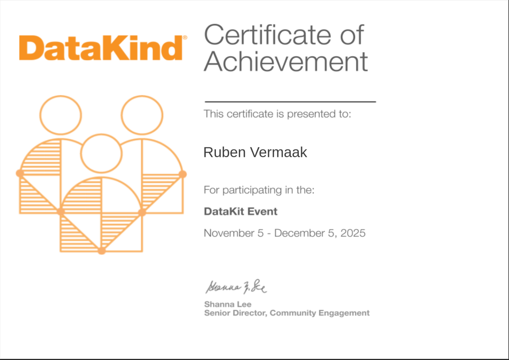

# Ruben Vermaak - Data Analyst

Welcome to my portfolio website! I'm a dedicated Data Analyst with a strong background in data manipulation, statistical analysis, and visualization. I am passionate about leveraging data to drive insightful and effective decision-making.

## About Me

I am currently instrumental in facilitating language acquisition as a teacher. Previously, I owned and operated a brewing company, managing everything from strategic vision to production and distribution. My experience also includes working as a Head Brewer, overseeing the complete beer production lifecycle.

I am currently pursuing the Google Advanced Data Analytics Professional certificate to enhance my skills in Python, machine learning, and advanced data visualization.

## Skills

* **Data Analytics:** Exploratory Data Analytics (EDA)
* **Programming:** SQL and R, Python
* **Visualization:** Tableau
* **Business Acumen:** Entrepreneurship & Business Acumen
* **Other:** Communication & Interpersonal Skills, Leadership & Management, Technical & Production (Brewing), Microsoft Excel, Microsoft Powerpoint, SQL, R, Python, Tableau, Adobe Illustrator
* **Languages:** English (native), Afrikaans (fluent), French (beginner)

## Experience

* **BIS sprout and academy** - Teacher (May 2024 - PRESENT)
    * Instrumental in facilitating language acquisition, fostering cross-cultural communication and student confidence.
* **Vermaak Brewing Company** - Brewer and Owner (July 2020 - January 2024)
    * Held a dual role encompassing strategic business leadership and hands-on brewing expertise. Responsible for the entire operation, from setting the company's vision and managing finances to formulating recipes, overseeing production and ensuring quality and distribution.
* **Dog And Fig Brewery** - Head Brewer (February 2019 - July 2020)
    * Responsible for the complete lifecycle of beer production, from strategic sourcing of raw materials to efficient distribution.

## Education

* **Pearson Institute of Higher Education** - Bachelor of Commerce (January 2016 - February 2019)
    * Comprehensive education in core business areas, including accounting, finance, economics, and management.
* **Pearson Institute of Higher Education** - Higher Certificate in Business Management (January 2015 - December 2015)
    * Provided foundational knowledge in core business principles.

## Certifications

* **Coursera** - Google Advanced Data Analytics Professional certificate (March 2025 - September 2025) [Credly](https://www.credly.com/badges/81be09d4-2897-4dcb-af6c-c63fd934d858/public_url)
    * Equipping me with advanced skills in data manipulation, statistical analysis, and machine learning using Python, along with data visualization and effective communication techniques.
* **Coursera** - Google Data Analytics Professional certificate (June 2024 - December 2024) [Credly](https://www.credly.com/badges/91ce9d3a-1ae9-4314-bc46-d3ec036a5752/public_url)
    * Provided practical training in the full data life cycle, from data cleaning to visualisation and reporting with excel and tableau, with an emphasis on making data-driven decisions.
* **TTA** - Teaching English In a Foreign Language (160 hours) (March 2023 - June 2023)
    * Provided necessary technical skills to be a competent and effective English language teacher.

## Projects
* Salifort Motors HR project [View](https://github.com/Rpvermaak/Google-Advanced-Data-Analytics-Projects/blob/main/Salifort%20Motor%20Capstone%20Project/Activity_%20Course%207%20Salifort%20Motors%20project%20lab.ipynb)
* Tiktok - Claim or Opinion Poject [View](https://github.com/Rpvermaak/Google-Advanced-Data-Analytics-Projects/tree/main/TikTok-Project)

* Wise - Customer Churn Project [View](https://github.com/Rpvermaak/Google-Advanced-Data-Analytics-Projects/tree/main/Waze-Project)

* New York City Taxi and Limousine Commission (TLC) [View](https://github.com/Rpvermaak/Google-Advanced-Data-Analytics-Projects/tree/main/TLC)

* BellaBeat Fitness Tracker Case Study - Showcasing R programing [View](https://github.com/Rpvermaak/BellaBeat-Case_Study/blob/main/Bellabeat_Case_Study.ipynb)

* Cyclectic Bike Sharing Case study - Showcasing ability to use SQL and Tableau [View](https://github.com/Rpvermaak/bike-share-project/blob/main/Bike_Share_Project.ipynb)

* Cyclistic Bike Share Dashboard 2024 - Tableau [view](https://public.tableau.com/views/daily_rides_summary/Dashboard1?:language=en-US&:sid=&:redirect=auth&:display_count=n&:origin=viz_share_link)

* Kaggle Simple Linear Regression - Advertising Data [View](https://www.kaggle.com/code/rubenvermaak/simple-linear-regression-advertising-data)

## Additional
* DataKind event(Fall 2025) Nov 5 - Dec 5 [View](https://github.com/Rpvermaak/datakit-smallholder-farmers-fall-2025/blob/main/Challenge%201%20_Weather%20Patterns/Ruben%20Vermaak/Challenge_1_Identifying_patterns_in_weather_and_agriculture_ruben_vermaak.ipynb)

* SASOL Tree Planting initiative, Park clean up initiative, Working on Fire - volunteer firefighter

## Contact

* Phone: 010 5901 6296
* Email: rpvermaak123@gmail.com
* LinkedIn: [www.linkedin.com/in/ruben-vermaak-29b225a1](www.linkedin.com/in/ruben-vermaak-29b225a1)
